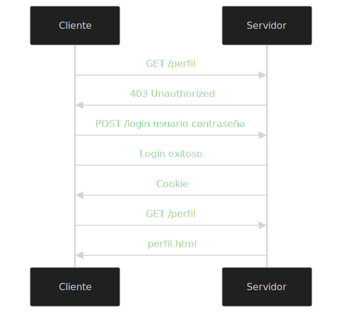

Vamos a explicar el proceso de autenticación de un usuario en una aplicación web utilizando cookies. En este caso, se utilizará Node.js y Express para crear un servidor web y gestionar las cookies.

## Autenticación

Vamos a recordar el proceso de autenticación básico de un usuario en una aplicación web:




El endpoint para iniciar sesión en el archivo``server.js` es:

```js
router.post('/login', (req, res) => {
    const user = req.body.user;
    const password = req.body.password;
    const hash = crypto.createHash('md5').update(password).digest('hex');
    const userObj = getUser(user);
    if (userObj && userObj.password === hash) {
        req.session.user = user;
        const token = crypto.randomBytes(64).toString('hex');
        req.session.token = token;
        res.cookie('token', token, { httpOnly: true, maxAge: 900000, secure: false });
        res.sendFile(path.join(__dirname, '../public/profile.html'));
    } else {
        res.status(401).send('Login incorrecto');
    }
});
```

En este endpoint:

1. Se obtienen los campos `user` y `password` del cuerpo de la petición.
2. Se obtiene el hash de la contraseña introducida por el usuario.
3. Obtenemos el usuario de la base de datos.
4. Comprobamos si el usuario existe y si la contraseña introducida coincide con la contraseña almacenada. Aqui es donde sucede la autenticación.
5. Si el usuario es autenticado correctamente, se crea una cookie con el nombre `token` y un valor aleatorio. Además, se crea una sesión con el nombre de usuario y el token.
6. La cookie irá en la cabecera de la respuesta y se enviará un archivo HTML con la página de perfil del usuario.
7. Desde ese momento, el usuario estará autenticado y podrá acceder a las páginas protegidas.

## Protección de rutas

Para proteger una ruta, se debe comprobar si el usuario está autenticado. Para ello, se debe comprobar si la cookie `token` está presente y si coincide con el token almacenado en la sesión.

El componente `middleware/auth.js` se encarga de realizar esta comprobación:

```js
const checkAuth = (req, res, next) => {
    if (req.session.user && req.session.token) {
      if (req.cookies.token === req.session.token) {
        next();
      } else {
        res.status(401).send('Unauthorized');
      }
    } else {
      res.status(401).send('Unauthorized');
    }
  };

module.exports = { checkAuth };
```

Este middleware se puede utilizar en cualquier ruta que se quiera proteger. Por ejemplo, en el archivo `server.js` se protege la ruta `/profile`:

```js
router.get('/profile', auth.checkAuth, (req, res) => {
    res.sendFile(path.join(__dirname, '../public/profile.html'));
});
```

En este caso, la ruta `/profile` solo será accesible si el usuario está autenticado. Si no lo está, se devolverá un error 401.

## Cierre de sesión

Para cerrar la sesión de un usuario, se debe enviar una petición POST a `/logout`. En esta petición, se eliminará la cookie `token` y se destruirá la sesión.

El endpoint para cerrar sesión en el archivo `server.js` es:

```js
router.post('/logout', (req, res) => {
    res.clearCookie('token');
    req.session.destroy();
    res.sendFile(path.join(__dirname, '../public/index.html'));
});
```

En este endpoint:

1. Se elimina la cookie `token` de la cabecera de la respuesta.
2. Se destruye la sesión del usuario.
3. Se envía el archivo HTML de la página de inicio.

## Seguridad

Algunos aspectos de seguridad a tener en cuenta cuando usamos cookies:

- **HttpOnly**: Las cookies deben tener la propiedad `httpOnly` para evitar que sean accedidas desde JavaScript. Esto evita ataques de tipo XSS.
- **Secure**: Si la aplicación se ejecuta en un entorno con `HTTPS`, se debe establecer la propiedad `secure` en `true` para que la cookie solo se envíe a través de conexiones seguras. Durante el desarrollo, se puede establecer en `false`.
- **SameSite**: Se puede establecer la propiedad `sameSite` en `strict` para evitar ataques de tipo CSRF en los que se envían peticiones desde otros sitios.
- **Max-Age**: Se puede establecer un tiempo de vida para la cookie con la propiedad `maxAge`. Esto evita que la cookie sea válida indefinidamente.
- **Tokens**: En lugar de almacenar información sensible en la cookie, se puede almacenar un token aleatorio y asociar la información con ese token en el servidor.
